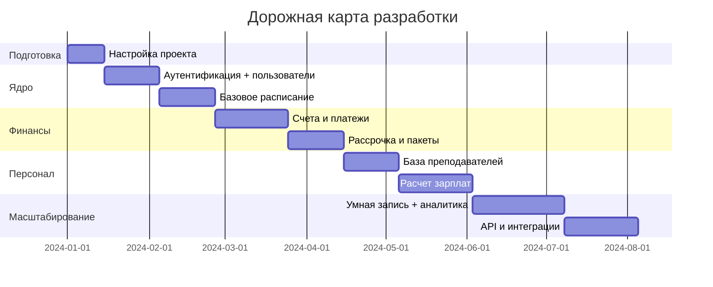

# Детальный план разработки CRM-системы для образовательной сферы (с нуля)

> **Проект:** образовательная CRM/ERP для музыкальных школ и тренинговых центров  
> **Цель:** создать масштабируемую, модульную систему с фокусом на расписание, финансы, личные кабинеты и управление персоналом  
> **Формат:** документ в Markdown для использования в репозитории и планировании

---

## 📋 Оглавление

1. [Обзор проекта и требования](#-обзор-проекта-и-требования)
2. [Рекомендуемый технологический стек](#-рекомендуемый-технологический-стек)
3. [Архитектура системы](#-архитектура-системы)
4. [Структура базы данных (ключевые сущности)](#-структура-базы-данных-ключевые-сущности)
5. [План разработки по фазам](#-план-разработки-по-фазам)
6. [Модульная структура и функционал](#-модульная-структура-и-функционал)
7. [API и интеграции](#-api-и-интеграции)
8. [Безопасность и права доступа](#-безопасность-и-права-доступа)
9. [Тестирование и QA](#-тестирование-и-qa)
10. [Деплой и инфраструктура](#-деплой-и-инфраструктура)
11. [Рекомендации по команде](#-рекомендации-по-команде)
12. [Дорожная карта и метрики успеха](#-дорожная-карта-и-метрики-успеха)

---

## 🔍 Обзор проекта и требования

### Бизнес-требования
| Приоритет | Требование | Описание |
|-----------|------------|----------|
| 🔴 Высокий | Управление расписанием | Гибкое планирование занятий, слоты, конфликты, уведомления |
| 🔴 Высокий | Финансовый модуль | Счета, платежи, рассрочка, контроль задолженностей, интеграция с платежными системами |
| 🔴 Высокий | Личные кабинеты | Студент, преподаватель, менеджер, админ — разный функционал и интерфейс |
| 🟡 Средний | Управление персоналом | База преподавателей, графики, договоры, расчет зарплат |
| 🟡 Средний | Бухгалтерия и отчетность | Финансовые отчеты, налоговые расчеты |
| 🟢 Низкий | Мобильное приложение | Адаптивный веб-интерфейс как первый шаг, нативное приложение — на втором этапе |

### Нефункциональные требования
- **Масштабируемость:** поддержка от 1 школы до 100+ организаций
- **Мультиязычность:** русский/английский (i18n)
- **Производительность:** отклик <500мс для 95% запросов
- **Безопасность:** шифрование персональных данных, соответствие 152-ФЗ
- **Отказоустойчивость:** 99.5% uptime, автоматическое резервное копирование

---

## ⚙️ Рекомендуемый технологический стек

### 🐍 Backend (приоритет: Python)

| Компонент | Вариант | Обоснование |
|-----------|---------|-------------|
| **Язык/фреймворк** | Python + FastAPI | Асинхронность, типизация, автодокументация, высокая производительность |
| **Альтернатива** | Python + Django + Django REST Framework | Более "из коробки" функционал, админ-панель, проверен временем |
| **ORM** | SQLAlchemy 2.0 + Alembic | Гибкость, поддержка асинхронности, миграции |
| **Валидация** | Pydantic v2 | Типизация, валидация данных, генерация схем OpenAPI |
| **Фоновые задачи** | Celery + Redis/RabbitMQ | Отложенные задачи: уведомления, расчеты, интеграции |
| **Кеширование** | Redis | Сессии, кеширование частых запросов, очереди |

### 🎨 Frontend

| Компонент | Вариант | Обоснование |
|-----------|---------|-------------|
| **Фреймворк** | Vue 3 + Composition API | Плавная кривая обучения, отличная документация, экосистема |
| **Альтернатива** | React 18 + TypeScript | Больше вакансий, шире сообщество, но сложнее вход |
| **UI-кит** | Element Plus / Ant Design Vue | Готовые компоненты таблиц, календарей, форм — экономия времени |
| **Сборка** | Vite | Быстрая сборка, горячая перезагрузка, оптимизация продакшена |
| **Состояние** | Pinia | Простая и типизированная альтернатива Vuex |

### 🗄️ База данных и хранение

| Компонент | Вариант | Обоснование |
|-----------|---------|-------------|
| **Основная БД** | PostgreSQL 15+ | Надежность, поддержка JSON, full-text search, расширения |
| **Миграции** | Alembic | Интеграция с SQLAlchemy, версионирование схемы |
| **Файлы** | S3-совместимое хранилище (MinIO / Yandex Object Storage) | Масштабируемость, резервное копирование, доступ по CDN |
| **Поиск** | PostgreSQL FTS или Meilisearch | Поиск по студентам, курсам, комментариям |

### 🚀 Инфраструктура и деплой

| Компонент | Вариант | Обоснование |
|-----------|---------|-------------|
| **Контейнеризация** | Docker + Docker Compose (dev), Kubernetes (prod) | Изоляция, воспроизводимость, масштабируемость |
| **Оркестрация** | Kubernetes (k3s для small, managed для prod) | Авто-масштабирование, self-healing |
| **CI/CD** | GitHub Actions / GitLab CI | Автоматизация тестов, сборки, деплоя |
| **Мониторинг** | Prometheus + Grafana + Loki | Метрики, логи, алертинг |
| **Хостинг** | Yandex Cloud / Selectel / Timeweb | Локализация данных, поддержка 152-ФЗ, рублевые тарифы |
| **CDN** | Cloudflare / Yandex CDN | Ускорение статики, защита от DDoS |

### 🔐 Безопасность и аутентификация

| Компонент | Вариант | Обоснование |
|-----------|---------|-------------|
| **Аутентификация** | JWT + Refresh tokens + HTTP-only cookies | Stateless, масштабируемость, защита от XSS |
| **Авторизация** | RBAC + ABAC гибридная модель | Гибкие права: роль + атрибуты (например, "менеджер только своих клиентов") |
| **2FA** | TOTP (Google Authenticator) | Дополнительная защита для админов и владельцев |
| **Шифрование** | AES-256 для чувствительных полей в БД | Защита персональных данных при компрометации БД |
| **Аудит** | Логирование всех критических действий | Отслеживание изменений, расследование инцидентов |

---

## 🏗️ Архитектура системы

```
┌─────────────────────────────────────────┐
│              Client Layer               │
│  ┌─────────┐  ┌─────────┐  ┌─────────┐  │
│  │ Web SPA │  │ Mobile  │  │ Admin   │  │
│  │ (Vue 3) │  │ (PWA)   │  │ Panel   │  │
│  └─────────┘  └─────────┘  └─────────┘  │
└────────────────┬────────────────────────┘
                 │ HTTPS / WebSocket
                 ▼
┌─────────────────────────────────────────┐
│            API Gateway                  │
│  • Rate limiting                        │
│  • Request validation                   │
│  • Routing to microservices             │
│  • CORS, Auth middleware                │
└────────────────┬────────────────────────┘
                 │
    ┌────────────┴────────────┐
    ▼                         ▼
┌─────────┐           ┌─────────────────┐
│ Core    │           │ Background      │
│ Services│           │ Workers         │
│ • Users │           │ • Celery        │
│ • Auth  │           │ • Notifications │
│ • Orgs  │           │ • Reports       │
│ • RBAC  │           │ • Integrations  │
└────┬────┘           └──────┬──────────┘
     │                       │
     ▼                       ▼
┌───────────┐           ┌────────────────┐
│ Domain    │           │ External       │
│ Modules   │           │ Services       │
│ • Schedule│           │ • Payment      │
│ • Finance │           │ • SMS/Email    │
│ • Students│           │ • 1C API       │
│ • Staff  	│           │ • Cloud Storage│
│ • Reports	│           └────────────────┘
└────┬──────┘
     │
     ▼
┌─────────────────┐
│   Data Layer    │
│ • PostgreSQL    │
│ • Redis         │
│ • S3 Storage    │
│ • Search Index  │
└─────────────────┘
```

> **Примечание:** Начинаем с монолита (modular monolith), при росте нагрузки выделяем сервисы в микросервисы.

---

## 🗃️ Структура базы данных (ключевые сущности)

```sql
-- Организации (школы, центры)
CREATE TABLE organizations (
    id UUID PRIMARY KEY DEFAULT gen_random_uuid(),
    name VARCHAR(255) NOT NULL,
    settings JSONB DEFAULT '{}',
    timezone VARCHAR(50) DEFAULT 'Asia/Yekaterinburg',
    created_at TIMESTAMPTZ DEFAULT NOW()
);

-- Пользователи (универсальная таблица)
CREATE TABLE users (
    id UUID PRIMARY KEY DEFAULT gen_random_uuid(),
    organization_id UUID REFERENCES organizations(id),
    email VARCHAR(255) UNIQUE NOT NULL,
    phone VARCHAR(20),
    password_hash VARCHAR(255),
    role VARCHAR(50) NOT NULL, -- student, teacher, manager, admin, owner
    profile_data JSONB DEFAULT '{}',
    is_active BOOLEAN DEFAULT true,
    created_at TIMESTAMPTZ DEFAULT NOW()
);

-- Курсы и продукты
CREATE TABLE courses (
    id UUID PRIMARY KEY DEFAULT gen_random_uuid(),
    organization_id UUID REFERENCES organizations(id),
    name VARCHAR(255) NOT NULL,
    price DECIMAL(10,2),
    duration_weeks INTEGER,
    lessons_count INTEGER,
    settings JSONB DEFAULT '{}', -- включает практику, рассрочку и т.д.
    is_archived BOOLEAN DEFAULT false
);

-- Расписание: слоты и занятия
CREATE TABLE time_slots (
    id UUID PRIMARY KEY DEFAULT gen_random_uuid(),
    organization_id UUID REFERENCES organizations(id),
    day_of_week INTEGER, -- 0=Monday, 6=Sunday
    start_time TIME NOT NULL,
    end_time TIME NOT NULL,
    room_id UUID,
    is_active BOOLEAN DEFAULT true
);

CREATE TABLE lessons (
    id UUID PRIMARY KEY DEFAULT gen_random_uuid(),
    course_id UUID REFERENCES courses(id),
    teacher_id UUID REFERENCES users(id),
    slot_id UUID REFERENCES time_slots(id),
    scheduled_at TIMESTAMPTZ NOT NULL,
    status VARCHAR(20) DEFAULT 'scheduled', -- scheduled, completed, cancelled
    attendees JSONB DEFAULT '[]' -- массив ID студентов
);

-- Финансы: счета и платежи
CREATE TABLE invoices (
    id UUID PRIMARY KEY DEFAULT gen_random_uuid(),
    student_id UUID REFERENCES users(id),
    course_id UUID REFERENCES courses(id),
    amount DECIMAL(10,2) NOT NULL,
    status VARCHAR(20) DEFAULT 'pending', -- pending, paid, overdue, cancelled
    due_date DATE,
    payment_method VARCHAR(50), -- card, cash, bank_transfer, installment
    external_id VARCHAR(100) -- ID в платежной системе
);

CREATE TABLE payments (
    id UUID PRIMARY KEY DEFAULT gen_random_uuid(),
    invoice_id UUID REFERENCES invoices(id),
    amount DECIMAL(10,2) NOT NULL,
    paid_at TIMESTAMPTZ DEFAULT NOW(),
    transaction_id VARCHAR(100),
    commission DECIMAL(5,2) DEFAULT 0 -- комиссия банка/школы
);

-- Рассрочка (если оплачивает школа)
CREATE TABLE installments (
    id UUID PRIMARY KEY DEFAULT gen_random_uuid(),
    invoice_id UUID REFERENCES invoices(id),
    total_parts INTEGER NOT NULL, -- 3 или 6
    paid_parts INTEGER DEFAULT 0,
    next_due_date DATE,
    auto_reminder BOOLEAN DEFAULT true
);

-- Сотрудники и зарплаты
CREATE TABLE staff_contracts (
    id UUID PRIMARY KEY DEFAULT gen_random_uuid(),
    teacher_id UUID REFERENCES users(id),
    contract_type VARCHAR(20), -- hourly, percent, fixed
    rate_per_hour DECIMAL(8,2),
    percent_of_revenue DECIMAL(5,2),
    tax_settings JSONB DEFAULT '{}'
);

CREATE TABLE salary_calculations (
    id UUID PRIMARY KEY DEFAULT gen_random_uuid(),
    teacher_id UUID REFERENCES users(id),
    period_start DATE,
    period_end DATE,
    lessons_count INTEGER,
    total_hours DECIMAL(6,2),
    gross_amount DECIMAL(10,2),
    tax_amount DECIMAL(10,2),
    net_amount DECIMAL(10,2),
    status VARCHAR(20) DEFAULT 'draft'
);

-- Задачи и уведомления
CREATE TABLE tasks (
    id UUID PRIMARY KEY DEFAULT gen_random_uuid(),
    organization_id UUID REFERENCES organizations(id),
    title VARCHAR(255) NOT NULL,
    description TEXT,
    assignee_id UUID REFERENCES users(id),
    author_id UUID REFERENCES users(id),
    priority VARCHAR(10) DEFAULT 'medium',
    due_date TIMESTAMPTZ,
    status VARCHAR(20) DEFAULT 'open',
    filters JSONB DEFAULT '{}' -- для сохранения наборов фильтров
);

-- Аудит и логирование
CREATE TABLE audit_log (
    id BIGSERIAL PRIMARY KEY,
    organization_id UUID,
    user_id UUID,
    action VARCHAR(50),
    entity_type VARCHAR(50),
    entity_id UUID,
    old_values JSONB,
    new_values JSONB,
    ip_address INET,
    created_at TIMESTAMPTZ DEFAULT NOW()
);

-- Индексы для производительности
CREATE INDEX idx_lessons_scheduled ON lessons(scheduled_at) WHERE status = 'scheduled';
CREATE INDEX idx_invoices_status ON invoices(status, due_date);
CREATE INDEX idx_users_org_role ON users(organization_id, role);
CREATE INDEX idx_audit_org_time ON audit_log(organization_id, created_at);
```

---

## 📅 План разработки по фазам

### 🔹 Фаза 0: Подготовка (Недели 1-2)
```markdown
- [ ] Настройка репозитория (Git, pre-commit hooks, .editorconfig)
- [ ] Инициализация проекта: FastAPI + SQLAlchemy + Alembic
- [ ] Настройка Docker Compose для локальной разработки
- [ ] Базовая структура БД: организации, пользователи, аутентификация
- [ ] Настройка CI/CD пайплайна (тесты, линтеры, сборка)
- [ ] Настройка мониторинга в dev-среде (Prometheus/Grafana)
```

### 🔹 Фаза 1: Ядро системы (Недели 3-8) — 🔴 Высокий приоритет
```markdown
## Модуль аутентификации и прав доступа
- [ ] Регистрация/вход (JWT + refresh tokens)
- [ ] RBAC: роли student/teacher/manager/admin/owner
- [ ] Middleware для проверки прав на уровне эндпоинтов
- [ ] Логирование входов и критических действий

## Модуль организаций и пользователей
- [ ] CRUD организаций (мульти-тенанси)
- [ ] Профили пользователей с расширенными полями
- [ ] Импорт/экспорт пользователей (CSV)
- [ ] Поиск и фильтрация по пользователям

## Базовое расписание
- [ ] CRUD временных слотов (день, время, аудитория)
- [ ] Создание занятий с привязкой к слоту и преподавателю
- [ ] Проверка конфликтов (преподаватель/аудитория/студент)
- [ ] Простой календарь в админ-панели (Week/Month view)

## Личный кабинет студента (MVP)
- [ ] Просмотр своего расписания
- [ ] История занятий и статусы
- [ ] Базовый профиль и контакты
```

### 🔹 Фаза 2: Финансы и платежи (Недели 9-14) — 🔴 Высокий приоритет
```markdown
## Модуль счетов и платежей
- [ ] Создание счетов с привязкой к курсу и студенту
- [ ] Статусы счетов: pending → paid / overdue / cancelled
- [ ] Интеграция с платежным шлюзом (ЮKassa / CloudPayments)
- [ ] Webhook-обработчик для подтверждения платежей
- [ ] Автоматическое обновление статуса счета после оплаты

## Рассрочка и пакеты
- [ ] Создание пакетных предложений (N занятий со скидкой)
- [ ] Логика рассрочки: 3/6 частей, напоминания о платежах
- [ ] Отслеживание остатка занятий в пакете
- [ ] Автоматические напоминания о предстоящих платежах

## Финансовая аналитика (MVP)
- [ ] Дашборд: выручка за период, задолженности
- [ ] Отчет по оплатам по способам (наличные/карта/р/с)
- [ ] Выгрузка данных для бухгалтерии (CSV/Excel)
```

### 🔹 Фаза 3: Управление персоналом и зарплатами (Недели 15-20) — 🟡 Средний приоритет
```markdown
## База преподавателей
- [ ] Расширенные профили: квалификация, договоры, ставки
- [ ] Графики доступности и предпочтения по времени
- [ ] Привязка преподавателей к курсам и аудиториям

## Расчет зарплат
- [ ] Гибкие тарифы: почасовая, процент от выручки, фикс
- [ ] Автоматический расчет за период на основе проведенных занятий
- [ ] Учет налогов и комиссий (настраиваемые правила)
- [ ] Генерация ведомостей и выгрузка в 1С / бухгалтерию (отложить в очень долгоий ящик, на будущие обновления)

## Задачи и коммуникации
- [ ] Система задач с назначением, приоритетами, дедлайнами
- [ ] Фильтры: "мои", "просроченные", "непрочитанные"
- [ ] Внутренние комментарии и упоминания @user
- [ ] Уведомления в интерфейсе (WebSocket / polling)
```

### 🔹 Фаза 4: Улучшения и масштабирование (Недели 21-26) — 🟢 Низкий/средний приоритет
```markdown
## Улучшение расписания
- [ ] "Умная запись": предложение слотов рядом с существующими
- [ ] Массовое создание занятий по шаблону (на месяц вперед)
- [ ] Интеграция с внешними календарями (Google Calendar, iCal)
- [ ] Мобильная адаптация календаря

## Расширенная аналитика
- [ ] Отчеты по загрузке преподавателей и аудиторий
- [ ] Коэффициент удержания студентов, LTV, отток
- [ ] Экспорт отчетов в PDF/Excel
- [ ] Настраиваемые дашборды (drag-and-drop виджеты)

## Уведомления и коммуникации
- [ ] Настройка каналов уведомлений: email / SMS / push / Telegram
- [ ] Шаблоны сообщений с переменными
- [ ] Личные предпочтения: какие уведомления получать
- [ ] Отложенные уведомления (напоминания за 24ч / 1ч до занятия)

## Безопасность и аудит
- [ ] 2FA для администраторов и владельцев
- [ ] Шифрование чувствительных полей в БД
- [ ] Детальный аудит-лог всех изменений
- [ ] Регулярное резервное копирование и тест восстановления
```

### 🔹 Фаза 5: Интеграции и экосистема (Недели 27-32+)
```markdown
## API для внешних интеграций
- [ ] Публичное REST API с документацией (OpenAPI 3.0)
- [ ] API-ключи с ограничением прав и rate limiting
- [ ] Webhooks для событий: оплата, запись, отмена
- [ ] Примеры интеграций: сайт школы, мобильное приложение, чат-бот

## Интеграция с 1С и бухгалтерией (отложить в очень долгоий ящик, на будущие обновления)
- [ ] Выгрузка проводок и контрагентов в формате 1С (отложить в очень долгоий ящик, на будущие обновления)
- [ ] Двусторонняя синхронизация справочников (по необходимости) (отложить в очень долгоий ящик, на будущие обновления)
- [ ] Настройка периодичности и правил синхронизации (отложить в очень долгоий ящик, на будущие обновления)

## Мобильное приложение (опционально)
- [ ] Адаптивный PWA как первый шаг
- [ ] Нативное приложение (React Native / Flutter) — отдельный проект
- [ ] Офлайн-режим для просмотра расписания
- [ ] Push-уведомления через Firebase / Yandex Push
```

---

## 🧩 Модульная структура и функционал

```
src/
├── core/
│   ├── config.py          # Настройки, env variables
│   ├── security.py        # JWT, хеширование, 2FA
│   ├── database.py        # Подключение к БД, сессии
│   └── dependencies.py    # Depends для FastAPI
│
├── modules/
│   ├── auth/
│   │   ├── schemas.py     # Pydantic модели входа/регистрации
│   │   ├── service.py     # Логика аутентификации
│   │   └── router.py      # Эндпоинты /auth/*
│   │
│   ├── organizations/
│   │   ├── models.py      # SQLAlchemy модели организаций
│   │   ├── service.py     # CRUD + мульти-тенанси логика
│   │   └── router.py
│   │
│   ├── users/
│   │   ├── models.py      # Пользователи, профили, роли
│   │   ├── service.py     # Управление пользователями
│   │   ├── rbac.py        # Проверка прав доступа
│   │   └── router.py
│   │
│   ├── schedule/
│   │   ├── models.py      # Slots, lessons, rooms
│   │   ├── service.py     # Логика расписания, проверка конфликтов
│   │   ├── smart_booking.py # Алгоритм "умной записи"
│   │   └── router.py
│   │
│   ├── finance/
│   │   ├── models.py      # Invoices, payments, installments
│   │   ├── service.py     # Создание счетов, обработка платежей
│   │   ├── payment_gateway.py # Интеграция с ЮKassa и др.
│   │   └── router.py
│   │
│   ├── staff/
│   │   ├── models.py      # Contracts, salary calculations
│   │   ├── service.py     # Расчет зарплат, тарифы
│   │   └── router.py
│   │
│   ├── tasks/
│   │   ├── models.py      # Задачи, комментарии, фильтры
│   │   ├── service.py     # CRUD задач, уведомления
│   │   └── router.py
│   │
│   └── reports/
│       ├── service.py     # Генерация отчетов, экспорт
│       ├── templates/     # Jinja2 шаблоны для PDF
│       └── router.py
│
├── workers/
│   ├── celery_app.py      # Настройка Celery
│   ├── tasks/
│   │   ├── notifications.py # Отправка email/SMS
│   │   ├── payments.py      # Проверка просроченных счетов
│   │   └── sync.py          # Синхронизация с внешними сервисами
│
├── api/
│   ├── v1/
│   │   ├── __init__.py    # Роутинг версий API
│   │   └── deps.py        # Общие зависимости
│
├── utils/
│   ├── logger.py          # Структурированное логирование
│   ├── validators.py      # Кастомные валидаторы
│   └── helpers.py         # Вспомогательные функции
│
├── tests/
│   ├── unit/              # Юнит-тесты сервисов
│   ├── integration/       # Интеграционные тесты API
│   └── conftest.py        # Фикстуры для тестов
│
├── alembic/
│   ├── versions/          # Миграции БД
│   └── env.py
│
├── frontend/              # Vue 3 приложение
│   ├── src/
│   │   ├── api/           # Axios инстансы, interceptors
│   │   ├── components/    # Переиспользуемые UI-компоненты
│   │   ├── views/         # Страницы: Dashboard, Schedule, Finance...
│   │   ├── stores/        # Pinia stores для состояния
│   │   ├── router/        # Vue Router с guards по ролям
│   │   └── utils/         # Форматирование дат, валют, i18n
│
├── docker/
│   ├── Dockerfile.backend
│   ├── Dockerfile.frontend
│   └── docker-compose.yml
│
├── .github/
│   └── workflows/
│       ├── test.yml       # Запуск тестов при PR
│       ├── build.yml      # Сборка образов
│       └── deploy.yml     # Деплой в staging/prod
│
└── docs/
    ├── API.md             # Документация API (автогенерация + ручные правки)
    ├── DEPLOYMENT.md      # Инструкция по деплою
    └── ARCHITECTURE.md    # Детальное описание архитектуры
```

---

## 🔌 API и интеграции

### Внутренний API (FastAPI)
```python
# Пример эндпоинта создания занятия
@router.post("/lessons", response_model=LessonOut)
async def create_lesson(
     LessonCreate,
    current_user: User = Depends(get_current_user),
    db: Session = Depends(get_db)
):
    # Проверка прав: менеджер или выше
    if not current_user.has_permission("schedule.create"):
        raise HTTPException(403, "Недостаточно прав")
    
    # Проверка конфликтов
    if await check_conflicts(db, data):
        raise HTTPException(409, "Обнаружен конфликт в расписании")
    
    # Создание занятия
    lesson = await LessonService.create(db, data)
    
    # Уведомление участников (фоновая задача)
    send_lesson_notifications.delay(lesson.id)
    
    return lesson
```

### Публичный API (для внешних интеграций)
```yaml
# openapi.yaml фрагмент
paths:
  /api/v1/webhooks/payment:
    post:
      summary: Webhook от платежной системы
      security:
        - ApiKeyAuth: []
      requestBody:
        content:
          application/json:
            schema:
              $ref: '#/components/schemas/PaymentWebhook'
      responses:
        '200':
          description: Webhook обработан
        '400':
          description: Неверная подпись или данные
```

### Интеграции с внешними сервисами
| Сервис | Назначение | Метод интеграции |
|--------|------------|-----------------|
| **ЮKassa / CloudPayments** | Прием платежей | Webhook + REST API |
| **SMS.ru / Twilio** | SMS-уведомления | REST API |
| **SendPulse / Unisender** | Email-рассылки | REST API |
| **Telegram Bot API** | Уведомления в мессенджер | Long polling / Webhook |
| **1C:Enterprise** | Обмен с бухгалтерией | COM / HTTP API / файловый обмен |
| **Google Calendar** | Синхронизация расписания | OAuth 2.0 + Calendar API |

---

## 🔐 Безопасность и права доступа

### Модель прав доступа (гибрид RBAC + ABAC)
```python
# Пример проверки прав
class PermissionChecker:
    PERMISSIONS = {
        "schedule.view": ["student", "teacher", "manager", "admin", "owner"],
        "schedule.create": ["manager", "admin", "owner"],
        "finance.view": ["manager", "admin", "owner"],
        "finance.export": ["admin", "owner"],  # только админ может выгружать
        "staff.salary.calculate": ["admin", "owner"],
    }
    
    @staticmethod
    def check(user: User, permission: str, resource: Optional[Model] = None) -> bool:
        # Базовая проверка по роли
        if user.role not in PermissionChecker.PERMISSIONS.get(permission, []):
            return False
        
        # ABAC: дополнительные проверки по атрибутам
        if permission == "finance.view" and resource:
            # Менеджер видит только финансы своей организации
            return resource.organization_id == user.organization_id
        
        return True
```

### Чеклист безопасности
- [ ] Все эндпоинты защищены аутентификацией (кроме публичных)
- [ ] Валидация входных данных через Pydantic (защита от injection)
- [ ] Rate limiting на критических эндпоинтах (вход, регистрация)
- [ ] Хеширование паролей через bcrypt/argon2
- [ ] JWT с коротким временем жизни + refresh tokens в HTTP-only cookie
- [ ] CORS настроен только на доверенные домены
- [ ] Чувствительные данные (телефон, паспорт) шифруются в БД
- [ ] Аудит-лог всех изменений в критических сущностях
- [ ] Регулярное обновление зависимостей (dependabot / renovate)

---

## 🧪 Тестирование и QA

### Стратегия тестирования
```markdown
## Unit-тесты (80%+ покрытие критических модулей)
- Тесты сервисов: finance.service, schedule.service
- Тесты валидации: Pydantic схемы, бизнес-правила
- Инструменты: pytest, pytest-asyncio, factory_boy

## Интеграционные тесты
- Тесты API-эндпоинтов с тестовой БД
- Проверка сценариев: "студент оплачивает → счет обновляется → уведомление отправлено"
- Инструменты: httpx, TestClient от FastAPI

## E2E-тесты (критические пользовательские сценарии)
- Сценарий: "Менеджер создает занятие → студент видит в личном кабинете"
- Инструменты: Playwright / Cypress для frontend, pytest для backend

## Нагрузочное тестирование
- Сценарии: 100 одновременных записей на занятие, генерация отчетов
- Инструменты: locust, k6

## Безопасность
- Статический анализ: bandit, safety
- Зависимости: регулярный аудит через pip-audit
- Пентест: ежегодный внешний аудит для prod-версии
```

### Пример теста сервиса
```python
# tests/unit/finance/test_invoice_service.py
async def test_create_invoice_auto_sets_due_date(db_session, student, course):
    service = InvoiceService(db_session)
    
    invoice = await service.create(
        student_id=student.id,
        course_id=course.id,
        amount=5000
    )
    
    assert invoice.due_date == datetime.date.today() + datetime.timedelta(days=7)
    assert invoice.status == "pending"
    assert invoice.organization_id == student.organization_id
```

---

## 🚀 Деплой и инфраструктура

### Docker Compose для разработки
```yaml
# docker-compose.yml
version: '3.8'
services:
  db:
    image: postgres:15-alpine
    environment:
      POSTGRES_DB: crm_dev
      POSTGRES_USER: dev
      POSTGRES_PASSWORD: dev_pass
    volumes:
      - pg/var/lib/postgresql/data
    ports:
      - "5432:5432"
  
  redis:
    image: redis:7-alpine
    ports:
      - "6379:6379"
  
  backend:
    build: 
      context: .
      dockerfile: docker/Dockerfile.backend
    command: uvicorn main:app --host 0.0.0.0 --reload
    volumes:
      - ./src:/app/src
    environment:
      - DATABASE_URL=postgresql://dev:dev_pass@db/crm_dev
      - REDIS_URL=redis://redis:6379/0
    ports:
      - "8000:8000"
    depends_on:
      - db
      - redis
  
  frontend:
    build:
      context: ./frontend
      dockerfile: ../docker/Dockerfile.frontend
    command: npm run dev -- --host
    volumes:
      - ./frontend:/app
    ports:
      - "5173:5173"
    depends_on:
      - backend

volumes:
  pgdata:
```

### Продакшен-деплой (Kubernetes)
```yaml
# k8s/backend-deployment.yaml (фрагмент)
apiVersion: apps/v1
kind: Deployment
meta
  name: crm-backend
spec:
  replicas: 3
  selector:
    matchLabels:
      app: crm-backend
  template:
    metadata:
      labels:
        app: crm-backend
    spec:
      containers:
      - name: backend
        image: registry.example.com/crm/backend:v1.2.0
        envFrom:
        - secretRef:
            name: app-secrets
        resources:
          requests:
            memory: "256Mi"
            cpu: "250m"
          limits:
            memory: "512Mi"
            cpu: "500m"
        livenessProbe:
          httpGet:
            path: /health
            port: 8000
          initialDelaySeconds: 30
          periodSeconds: 10
---
apiVersion: v1
kind: Service
meta
  name: crm-backend
spec:
  selector:
    app: crm-backend
  ports:
  - port: 80
    targetPort: 8000
  type: ClusterIP
```

### Мониторинг и алертинг
```yaml
# prometheus/alerts.yml
groups:
- name: crm_alerts
  rules:
  - alert: HighErrorRate
    expr: rate(http_requests_total{status=~"5.."}[5m]) > 0.1
    for: 2m
    labels:
      severity: critical
    annotations:
      summary: "Высокий уровень ошибок на {{ $labels.instance }}"
  
  - alert: DatabaseConnectionsHigh
    expr: pg_stat_database_numbackends > 80
    for: 5m
    labels:
      severity: warning
```

---

## 👥 Рекомендации по команде

### Минимальная команда для MVP (Фазы 0-2)
| Роль | Задачи | Часов/неделю |
|------|--------|--------------|
| **Backend-разработчик (Python)** | Архитектура, API, БД, интеграции | 40ч |
| **Frontend-разработчик (Vue)** | UI, личные кабинеты, календарь | 40ч |
| **DevOps / Fullstack** | Деплой, CI/CD, инфраструктура | 20ч |
| **QA / Тестировщик** | Тест-планы, автотесты, ручное тестирование | 20ч |
| **Product Owner (вы)** | Требования, приоритеты, приемка | 10-15ч |

### Оптимизация для solo-разработчика
Если вы разрабатываете в одиночку:
1. Используйте **Django вместо FastAPI** — больше готового функционала "из коробки" (админка, аутентификация, миграции)
2. Начните с **монолитной архитектуры** — проще деплоить и отлаживать
3. Используйте **готовые UI-компоненты** (Element Plus) — не тратьте время на кастомные кнопки
4. Автоматизируйте рутину: pre-commit hooks, шаблоны кода, скрипты деплоя
5. Фокусируйтесь на **одном модуле за раз** — не распыляйтесь

---

## 🗺️ Дорожная карта и метрики успеха

### Квартальная дорожная карта


### Метрики успеха (по фазам)
| Фаза | Технические метрики | Бизнес-метрики |
|------|---------------------|----------------|
| **Фаза 1** | • Отклик API <500мс • Покрытие тестами >70% • Успешный деплой в staging | • MVP готов к демо • Первые 3 тестовых школы подключены |
| **Фаза 2** | • 99% успешных платежей • Автоматические уведомления работают | • Конверсия оплаты >85% • Снижение ручного труда администраторов на 30% |
| **Фаза 3** | • Расчет зарплаты <2с на 50 преподавателей | • Экономия 10+ часов/мес на расчете зарплат • Удержание преподавателей +15% |
| **Фаза 4+** | • Масштабирование до 100 организаций • Uptime 99.5%+ | • NPS >40 • LTV клиента +25% за счет доп. модулей |

---

## 📎 Приложения

### Приложение А: Глоссарий терминов
| Термин | Определение |
|--------|-------------|
| **Слот** | Временной интервал для занятия (например, Пн 18:00-20:00) |
| **Пакет** | Набор занятий, оплачиваемых единовременно со скидкой |
| **Рассрочка от школы** | Оплата курса частями, где школа выступает кредитором |
| **Умная запись** | Алгоритм, предлагающий слоты, соседствующие с уже записанными занятиями студента |
| **Мульти-тенанси** | Архитектура, где одна инсталляция обслуживает множество независимых организаций |

### Приложение Б: Ссылки на документацию
- [FastAPI Docs](https://fastapi.tiangolo.com/)
- [Vue 3 Guide](https://vuejs.org/guide/introduction.html)
- [SQLAlchemy 2.0 Tutorial](https://docs.sqlalchemy.org/en/20/tutorial/)
- [PostgreSQL JSONB Best Practices](https://www.postgresql.org/docs/current/datatype-json.html)
- [1C:Enterprise HTTP API](https://users.v8.1c.ru/development/http/)
